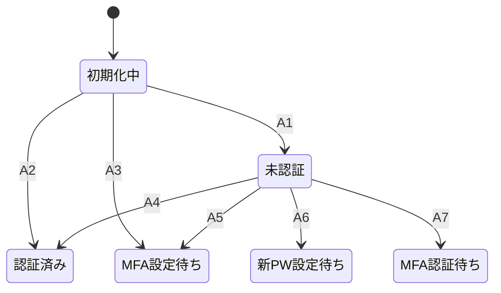
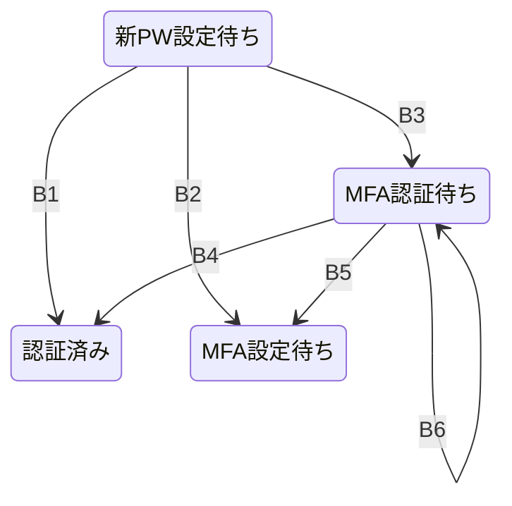
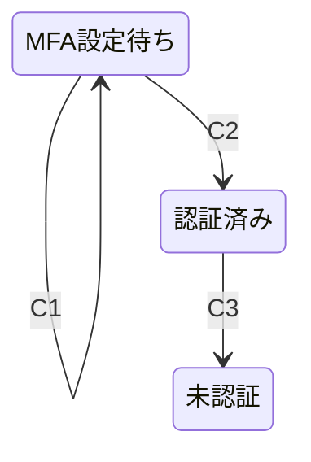

# 11-4. auth-02

## 検証対象

- rehacul との auth 挙動同等性（移行検証）

## 目的

- rehacul で成立している認証挙動を cdk_pf 側で同等に再現できることを確認する

## 検証スコープ

- `MFA強制導線`: 毎回ログイン時に認証コード確認を要求する
  - Cognito は MFA 必須の設定とし、対象ユーザーは MFA 利用状態で運用する
  - 通常ログインで `signIn` 後に `nextStep.signInStep` で MFA 確認ステップへ遷移する構成とする
  - フロントは Amplify Auth/UI の `confirmSignIn` で確認コード入力を完了する構成とする
- `初回/仮パスワード導線`: パスワード確定前ユーザーに新規パスワード設定 UI を表示する
  - 仮パスワードログイン時は `new_password_required` 相当ステップへ遷移する構成とする
  - 新パスワード確定後は MFA 導線へ遷移する構成とする
- `MFAセットアップ導線`: 初回ログイン時に MFA 未設定ユーザーを設定フローへ誘導する
  - `mfa_setup` 相当ステップで Email/SMS 選択と連絡先入力を要求する構成とする
  - 確認コード検証完了で認証済み状態へ遷移する構成とする
- `MFAコード再送`: 確認コード未着・期限切れ時に再送できること
  - MFA 設定時および MFA 認証時に再送導線を提供する構成とする
  - 再送後は最新コードのみ有効となる前提で扱う構成とする
- `SMS MFA導線`: rehacul 同様に SMS を使った認証導線が成立すること
  - MFA 手段として SMS を選択可能とする
  - SMS での確認コード送信・確認を行う構成とする
  - AWS 側の Cognito/SMS送信設定を満たした環境で動作する前提とする
- `Email MFA送信基盤`: Email MFA の送信経路を段階的に整備する
  - 現段階は SES のドメイン配下送信元アドレス（`proto-foundation.com` 配下）を採用する構成とする
  - IaC の deploy 入力値は `SES_FROM_EMAIL` とし、送信元メールアドレス文字列を受け取る構成とする
  - `SES_FROM_EMAIL` を元に SES identity を作成し、Cognito UserPool の `emailConfiguration`（DEVELOPER）へ接続する構成とする
  - 実行基盤の共有値は `/pf/shared/<sharedEnv>/...`、CI/CD の deploy 入力値は `/pf/cd/<sharedEnv>/env/...` で管理する構成とする
- `クライアント種別ログイン制御`: clientId ごとに許可ロールが制御されること
  - `web / app / adminWeb / function / test` の client 種別で pre-auth 判定を分岐する構成とする
  - 非許可ロールはログイン拒否する構成とする
- `MFA未設定ユーザーのAPI制御`: MFA未設定ユーザーの業務操作を拒否できること
  - token claim の `mfaPreference` が `none` の場合は対象 operation を拒否する構成とする
  - 認証済みでも MFA 未完了なら業務 API は実行不可とする
- `トークンclaim整形`: 認可判定に必要な claim が付与されること
  - `custom:mfa_preference` / `custom:institution_id` を token claim に反映する構成とする
  - 個人情報 claim（email/phone）は suppress する構成とする
- `認証状態管理`: 判定源と状態保持の責務を分離する
  - ログイン段階の判定源は Cognito 応答（`signIn.nextStep` / `fetchMFAPreference`）を優先する構成とする
  - 永続状態は `users.mfaPreference`（`none/sms/email`）で管理する構成とする
  - 画面遷移状態（`new_password_required` / `mfa_setup` / `mfa_required` など）はフロントの一時状態で管理する構成とする

## 認証状態遷移図（auth-02）

### 起動・サインイン遷移

- A1: セッションなし
- A2: セッションあり + MFA設定済み
- A3: セッションあり + MFA未設定
- A4: ログイン成功 + MFA設定済み
- A5: ログイン成功 + MFA未設定
- A6: 仮パスワード更新が必要
- A7: 確認コード入力が必要

### 新パスワード・MFA認証遷移

- B1: 新PW確定 + MFA設定済み
- B2: 新PW確定 + MFA未設定
- B3: 新PW確定後に確認コード要求
- B4: 確認コード成功 + MFA設定済み
- B5: 確認コード成功 + MFA未設定
- B6: コード再送

### MFAセットアップ・サインアウト遷移

- C1: 手段選択 / コード送信 / 再送
- C2: MFA設定完了
- C3: ログアウト / セッション失効

## スコープ外

- テナント間の詳細権限制御
- ABAC のような属性ベース認可の設計

## 着手条件

- `11-3.auth-01` で認証導線と Authorizer context が利用可能であること

## 決定ログ

- 2026-04-28: 章テンプレートを統一し、未着手スコープを明文化
- 2026-05-01: rehacul 移行検証として、auth-02 の検証対象を MFA/初回パスワード/clientId 制御/claim 整形の同等性確認へ更新
- 2026-05-02: Email MFA の IaC 入力値（`SES_FROM_EMAIL`）と `/pf/shared`・`/pf/cd` の責務分離を明文化
- 2026-05-03: Email MFA の送信元を `proto-foundation.com` ドメイン配下アドレスで統一する方針を追加
